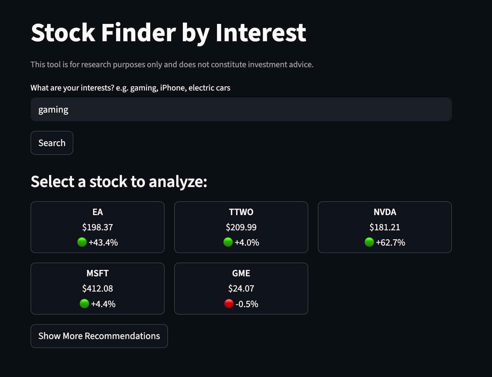
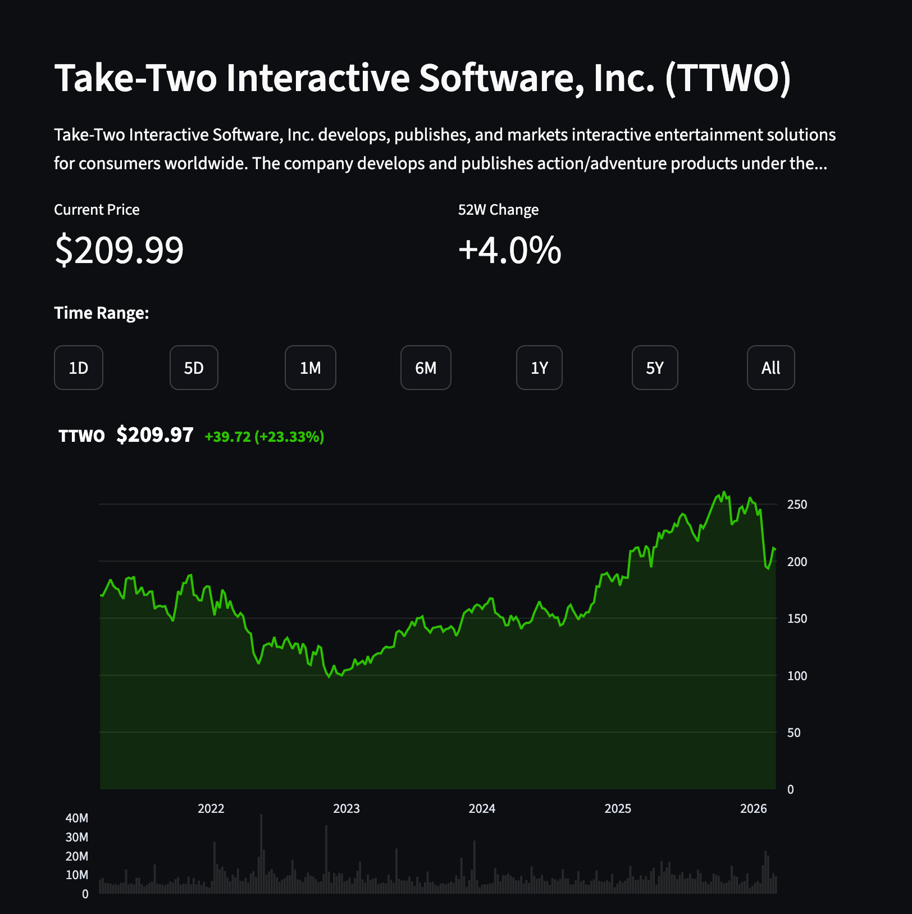
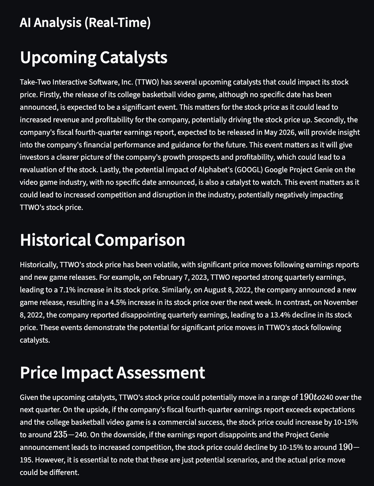
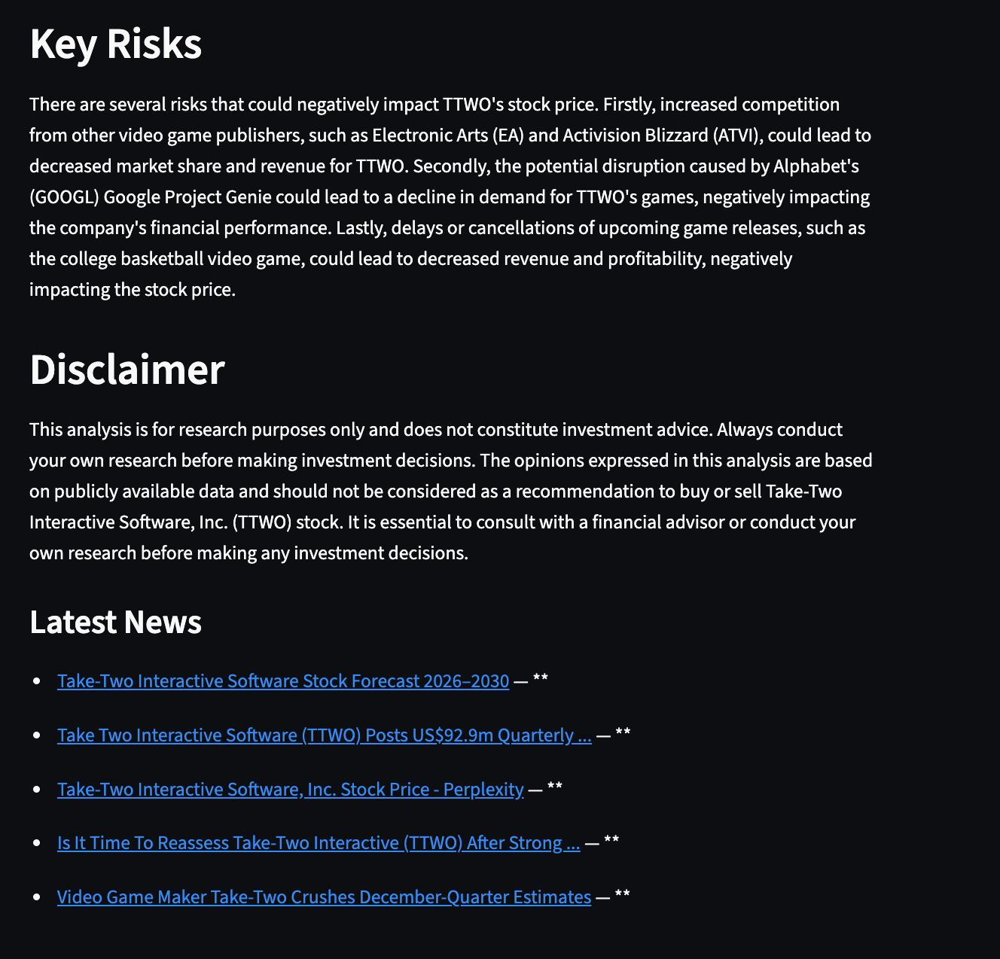

# Stock Finder by Interest

Discover stocks related to your personal interests and get real-time AI-powered analysis.

## The Problem

I always wanted to invest in stocks but didn't want to blindly follow internet recommendations. 
I realized I could look at products I use every day and find investment potential in them — 
without needing to be a finance expert. So I built this tool.

## What It Does

Enter your interests (e.g. gaming, iPhone, electric cars) and the app will:

- Find 6 publicly traded companies related to your interests
- Show each stock's historical price chart
- Provide a real-time AI analysis including upcoming catalysts, historical comparisons, potential price impact, and key risks
- Link to the actual news articles used in the analysis

## Features

- Interest-based stock discovery
- Interactive price charts with volume (1D to All-time)
- Real-time AI analysis powered by live news
- Show More to get additional recommendations on the same topic
- Input validation to handle irrelevant queries

## Tech Stack

| Technology | Purpose |
|------------|---------|
| Python | Core language |
| Streamlit | Web interface |
| Groq (Llama 3.3 70B) | AI analysis and company matching |
| Tavily | Real-time news search |
| yfinance | Stock price data |
| Plotly | Interactive charts |

## How to Run

1. Clone the repository
2. Install dependencies: `pip install -r requirements.txt`
3. Create a `.env` file with your API keys:
```
GROQ_KEY=your_key
TAVILY_KEY=your_key
```
4. Run: `streamlit run app.py`

## Screenshots







